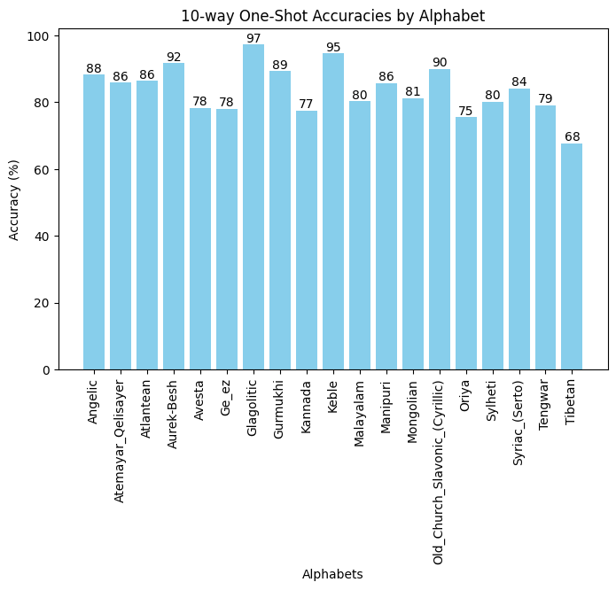

# Siamese Neural Networks for One-shot Image Recognition

This is a PyTorch implementation of the paper "Siamese Neural Networks for One-shot Image Recognition" ([https://www.cs.cmu.edu/~rsalakhu/papers/oneshot1.pdf](https://www.cs.cmu.edu/~rsalakhu/papers/oneshot1.pdf))
from 2015. I have not recreated the MNIST One-Shot trials (section 4.4 in the paper) and my implementation also differs somewhat in some areas (mainly the training and hyperparameter optimization) which we will
discuss in the implementation section.

## Overview

I will provide a longer summary of the paper on my blog (LINK), this is just a quick rundown of the general ideas.

This paper is an early study on metric learning for one shot image classification. Specifically we work with the Omniglot dataset, a collection of handwritten 
characters from 50 different alphabets. The problem is as followed, we are given the data from a limited number of alphabets to train a model that is then tasked
to do one shot classification on the remaining alphabets. The model is shown a character from an alphabet it has not seen yet, 
together with one example each of N characters from that alphabet (including one example displaying the character it has to classify) and is asked to classify the character based on that.

To solve this problem we do not want to learn the classification problem directly but insted we want to learn a metric or similarity measure on the image space, based on our training alphabets.
Once we have a metric for the train data, under the assumption that it somewhat transfers to the unknown alphabets, we can solve the one shot classification by simply choosing that class whose example maximizes
the similarity measure with the given image.

The authors use a siamese network to learn the similarity. It consists of two versions of the same CNN whose outputs are combined via euclidean metric with a one layer classifier on top.
The net is shown image pairs (one for each siamese twin) and tasked to output 1 if the images match (same character) and 0 if they do not.

## Implementation

The implementations is written in PyTorch

    
    

    
    

    
    

