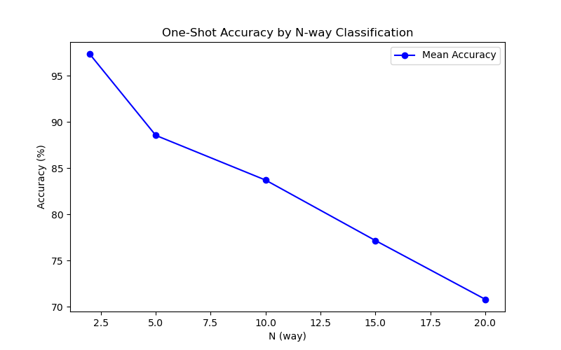
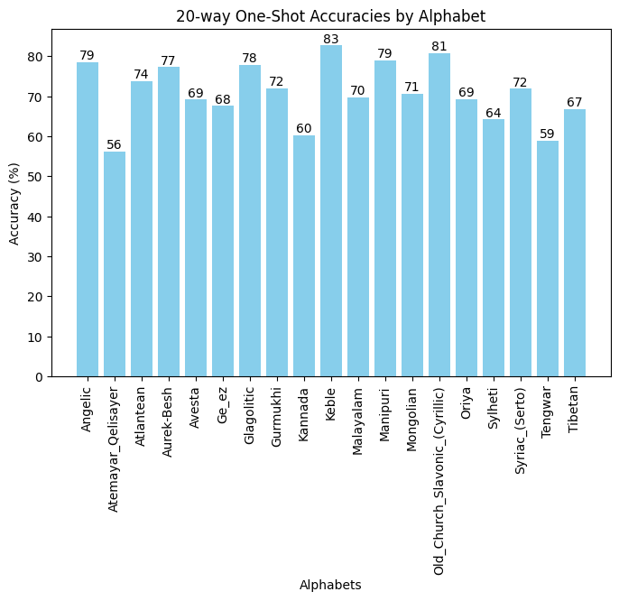

# Siamese Neural Networks for One-shot Image Recognition

This is a PyTorch implementation of the paper "Siamese Neural Networks for One-shot Image Recognition" ([https://www.cs.cmu.edu/~rsalakhu/papers/oneshot1.pdf](https://www.cs.cmu.edu/~rsalakhu/papers/oneshot1.pdf))
from 2015. I have not recreated the MNIST One-Shot trials (section 4.4 in the paper) and my implementation also differs somewhat in some areas (mainly the training and hyperparameter optimization) which we will
discuss in the implementation section.

## Overview

I will provide a longer summary of the paper on my blog ([here](https://github.com/QuantumSpinozist/quantumspinozist.github.io/blob/main/paper_report_9.md)), this is just a quick rundown of the general ideas.

This paper is an early study on metric learning for one shot image classification. Specifically we work with the Omniglot dataset, a collection of handwritten 
characters from 50 different alphabets. The problem is as followed, we are given the data from a limited number of alphabets to train a model that is then tasked
to do one shot classification on the remaining alphabets. The model is shown a character from an alphabet it has not seen yet, 
together with one example each of N characters from that alphabet (including one example displaying the character it has to classify) and is asked to classify the character based on that.

To solve this problem we do not want to learn the classification problem directly but insted we want to learn a metric or similarity measure on the image space, based on our training alphabets.
Once we have a metric for the train data, under the assumption that it somewhat transfers to the unknown alphabets, we can solve the one shot classification by simply choosing that class whose example maximizes
the similarity measure with the given image.

The authors use a siamese network to learn the similarity. It consists of two versions of the same CNN whose outputs are combined via euclidean metric with a one layer classifier on top.
The net is shown image pairs (one for each siamese twin) and tasked to output 1 if the images match (same character) and 0 if they do not.

## Usage

To retrain the model from scratch with the default hyperparameters you can run

```bash
python main.py --no-load-last-model --train-model --no-n-way-one-shot
```
or
```bash
python main.py --no-train-model --n-way-one-shot
```
if you just want to run the one shot tasks with different numbers of classes without training a new model.
You can look into the main file for a list of all available flags.

## Implementation Differences and Results

The main difference of our implementation to the one provided in the paper is that we use a simpler training.
The authors of the paper use a variable learning rate for each layer and keep some of the architecture parameters
variable as part of hyperparameter tuning which they perform via Bayesian optimization.
For said hyperparameter optimization the performance on one shot tasks on a validation set is used as an
objective.

In my implementation I simply use a universal learning rate with a scheduler decaying it periodically.
With respect to the verification task I reach an accuracy of 95% on the test data after around 200 epochs.

In the original paper they only look at 20 way one shot tasks (so 20 different classes) but I find it quite
instructive to also look at how performance changes as we increase the number of classes.



For just two classes the accuracy is around 97%, as we expand the number of classes this performance steadily decreases,
reaching around 71% at 20 classes. On its own this performance is quite good outperforming all benchmarks provided in the paper
except for the top 2 (excluding the papers model and human here). But there is still a very significant
gap to the performance reported in the paper. We will attempt to explain this gap at the end of this section.

We also look at the individual performances for different alphabets. While this does seem to vary as we change the number
of classes (possibly since we in/exclude difficult characters), we can clearly see that the model struggles more with
some of the alphabets. For example Atemayar Qelisayer and Tibetan, tend to underperform. 

<p float="left">
    
    
</p>

<p float="left">
    
    
</p>



So why do we see such a significant performance gap?  Obviously doing extensive hyperparameter optimization and a more
flexible training pipeline is generally helpful,
but I think in this case one shot performance being used as the model selection objective is particularly significant. Even if our model
has learned good features from training on the verification task, if it "has not seen" the one shot task at all it might still underperform there.

To give a concrete example for a possible problem, deep learning models right after training famously tend to be miscalibrated (overconfident even for difficult samples).
If one out of our one shot examples is wrongly matched by a well calibrated model (similarity >0.5$ but significantly smaller than $1$) while the correct example is also matched,
the sample will still be classified correctly, since we only care about the highest score.
If we now imagine the same for an overonfident model, even one mismatch might lead to a classification error. This problem gets exponentially worse as we increase the number of classes.

I have found a different reimplementation of the paper by asagar60 ([https://github.com/asagar60/Siamese-Neural-Networks-for-One-shot-Image-Recognition](https://github.com/asagar60/Siamese-Neural-Networks-for-One-shot-Image-Recognition))
who has also not implemented the hyperparameter optimization and achieves similar one shot performances.

I might add some of the missing aspects reported in the paper in the future, or otherwise extend this project, in which case I will extend
discussion accordingly.


